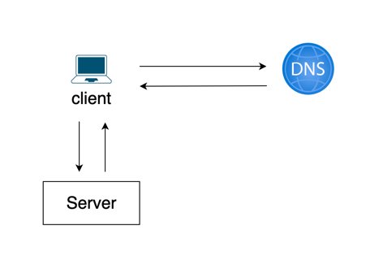
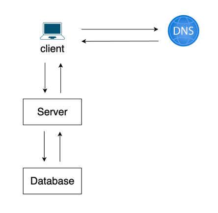
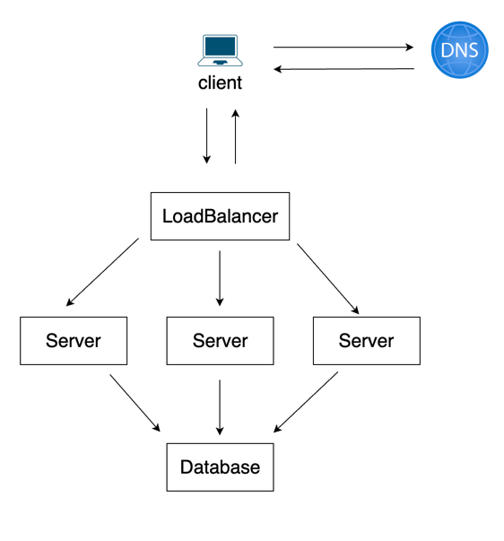
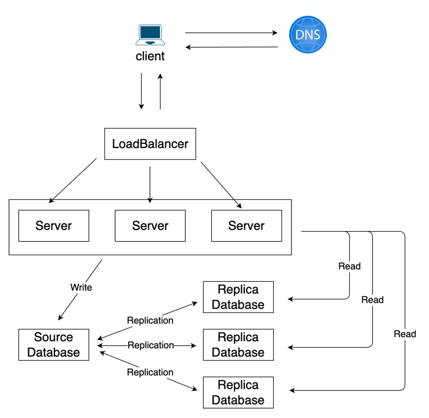

# 사용자 수에 따른 규모 확장성

## 단일 서버

* 모든 컴포넌트가 한 대의 서버에서 실행되는 가장 간단한 구성 방식
* 가장 간단한 만큼 많은 사용자가 이용한다면 트래픽을 처리하기 어렵고, 가용성, fail over 가 불가능하여 실제 서비스에서는 사용하지 않는다.

* 사용자가 증가함에 따라 각자의 확장성을 위해서 서버와 데이터베이스를 분리한다.
* 비용적 측면의 서버와 데이터베이스 비교
  * 서버는 저렴하므로 스케일 아웃하기 용이하다.
  * 데이터베이스는 비싸고 스케일 아웃하기 어려우므로 스케일 업을 한다.

#### 어떤 데이터베이스를 사용할 것인가?
* 전통적으로는 RDB를 많이 사용했지만 최근에는 성능적, 기능적, 비즈니스 요건에 따라 NoSQL 등 다양한 데이터베이스를 사용한다.
* RDB는 HA, Failover를 위해 Source-Replica(구, Master-Slave) 구조를 가질 수 있다.
* NoSQL은 Key-value Store, Graph Store, Column Store, Document Store 등 다양한 구조의 데이터베이스가 존재한다.

## 수직적 규모 확장 vs 수평적 규모 확장
#### 스케일 업(Scale up)
* CPU, Memory 등 고사양의 자원을 추가하는 행위이다.
  * 장점
    * 단순하다.
  * 단점
    * 한 대의 서버에 CPU나 메모리를 무한대로 증설할 수는 없으므로 한계가 있다.
    * 다중화를 통한 HA, Failover를 할 수 없다.
#### 스케일 아웃(Scale out)
* 새로운 서버를 새로 증설하여 수평적으로 자원을 추가 확장하는 행위이다.
* 트래픽에 따라 유동적으로 서버를 증설하고, 줄임으로써 비용을 효율화 시킬 수 있다.
* 다중화를 통한 HA, Failover를 통해 비즈니스 안정성을 높일 수 있다.
* 유동적으로 늘어나고 줄어드는 서버에 대해서 사용자의 트래픽을 분산 시켜주어야 하는데, 로드밸런서를 통해 가능하다.

#### 로드밸런서

* 로드밸런서는 여러 서버들에게 트래픽을 골고루 분배하여 부하를 분산시켜준다.
* 구성에 따라 각 L7, L4, L3, L2 레이어에서 로드밸런싱을 할 수 있다.
* 클라이언트는 서버에 직접 접근하는게 아니라 로드밸런서로 접근하고 로드밸런서는 해당 요청을 서버로 서빙한다.
* 특정 서버에서 문제가 발생하면 로드밸런서는 해당 서버로의 트래픽을 차단하고 다른 서버로 트래픽을 몰아줌으로써 고가용성을 확보할 수 있다.

#### 데이터베이스 다중화

* 데이터베이스 다중화는 Source-Replica(구. Master-Slave) 구조이다.
  * Source 서버에서는 Write 연산을 한다.
  * Replica 서버에서는 Read 연산을 한다.
* 대부분의 애플리케이션은 Write 보다 Read 연산의 비중이 훨씬 크다.
  * 다중화를 통해 서버 트래픽의 부하에 따라 Replica 서버 구축이 가능하다.
* 데이터베이스를 여러 지역에 분산시켜 놓음으로써 자연재해, 전쟁 등으로부터 하나의 서버가 파괴되더라도 데이터를 보존할 수 있다.
* 다중화를 통해 Source 서버에 장애가 발생하더라도 Replica 서버 중 하나를 선출하여 Source 서버로 승격 시켜서 장애 시간을 최소화 시킬 수 있다.
* 네트워크나 서버의 상황에 따라 복제 지연이 발생할 수 있다.

## 캐시
* 캐시는 비용이 많이드는 연산 결과, 정적 데이터 또는 자주 참조되는 데이터를 메모리에 저장하여 접근 속도를 빠르게 해준다.
* 서버와 데이터베이스 중간에 위치시켜서 이전에 조회했던 데이터에 대해서는 데이터베이스에서 조회하지 않고, 캐시에서 바로 데이터를 가져와서 응답함으로써 데이터베이스의 부하를 줄일 수도 있다.

#### 캐시 사용 시 유의할 점
* 데이터베이스에서 변경이 일어나는 경우, 데이터의 정합성을 위해서 캐시에 적재된 데이터를 Evict 시켜주어야 한다.
* 캐시에 보관된 데이터에 대해서 만료 정책을 정하여 캐시 데이터가 증가함에 따라, 메모리를 모두 사용하게 되어 OOM이 발생하지 않도록 해야한다.
  * 알고리즘으로는 LRU(Least Recently Used), LFU(Least Frequently Used), FIFO(First In First Out) 등이 있다.
* 데이터베이스에서 원본 데이터를 갱신하는 연산과, 캐시를 갱신하는 연산이 단일 트랜잭션으로 처리되지 않는 경우 일관성이 깨질 수 있으므로 주의해야한다.

## CDN (Content Delivery Network)
* CDN은 정적 콘텐츠를 캐싱해두고 전송하는 데 쓰이는, 지리적으로 분산된 서버의 네트워크이다.
* 이미지, 비디오, CSS, Javascript 파일 등을 캐시할 수 있다.
* CDN 은 사용자가 웹사이트에 방문하면, 그 사용자에게 가장 가까운 CDN 서버가 정적 콘텐츠를 전달한다.
  * 만약 사용자에게 필요한 정적 콘텐츠가 CDN에 없다면 서버에 요청하여 가져온 다음, CDN에 적재하여 다음 요청부터는 CDN을 통해서 정적 콘텐츠를 제공받을 수 있다.
* 콘텐츠 업데이트를 위해 CDN에 저장된 콘텐츠를 무효화 시키고 싶다면 아래와 같은 방법으로 제거할 수 있다.
  * CDN 서비스 사업자가 제공하는 API를 이용하여 콘텐츠 무효화
  * 컨텐츠의 다른 버전을 서비스하도록 오브젝트 버저닝(object versioning)을 이용
