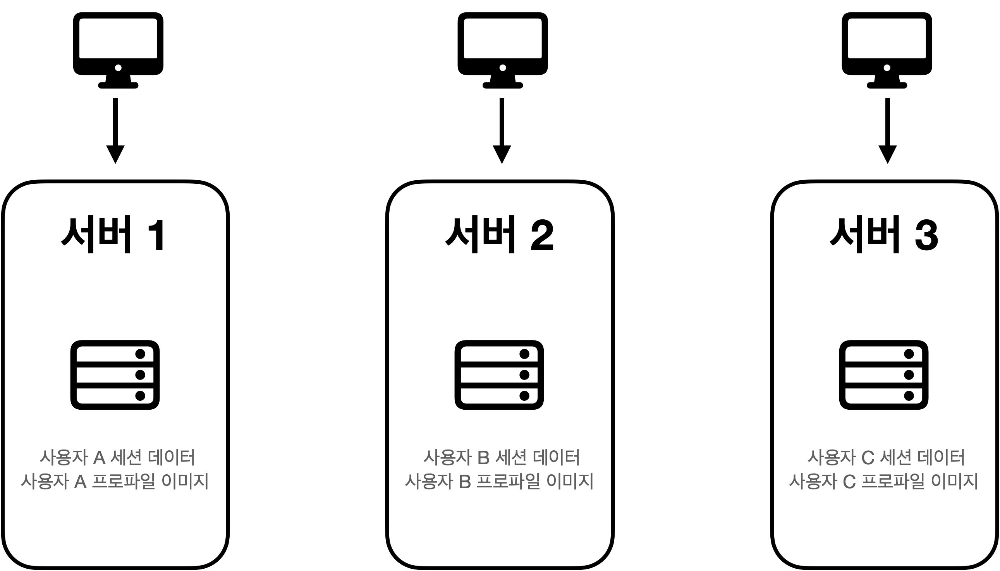
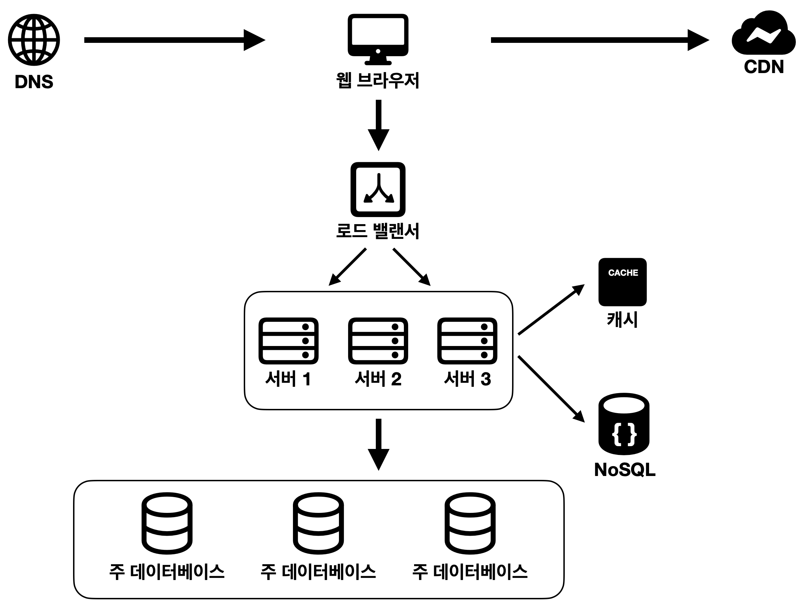
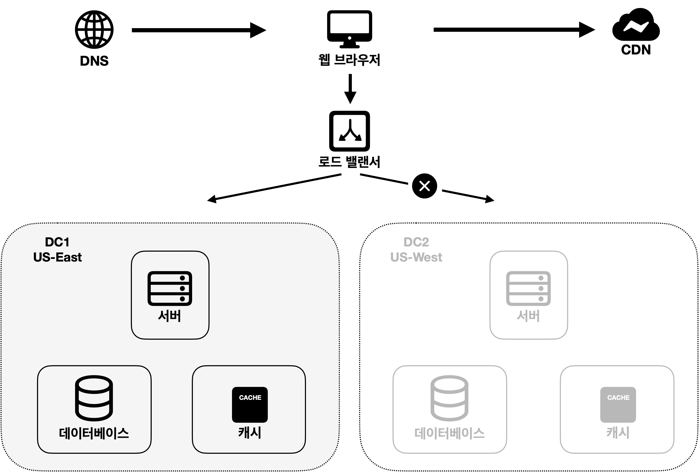

# 1-2장 - 사용자 규모에 따른 확장성

# 무상태(stateless) 웹 계층

웹 계층을 수평적으로 확장하려면 가장 먼저 해야할 일은 무엇일까?

서버에 상태 정보를 가지고 있다면 서버 대수를 늘렸을 경우 문제가 발생한다.

사용자 세션 데이터를 웹 계층에서 제거하자.

## 상태 정보 의존적인 아키텍처

**그림 1-12**

- **그림 1-12**에서 사용자 A의 세션 정보나 이미지와 같은 상태 정보는 서버 1에 저장된다.
- 사용자 A는 서버에 인증하기 위해 반드시 서버 1로 HTTP 요청을 전송해야 한다.
- 각각의 클라이언트 요청이 정해진 서버로 요청해야 한다는 문제점이 있다.

## 무상태 아키텍처

**그림 1-13**

- 이 구조에서는 사용자의 HTTP 요청은 어떤 웹 서버로도 전달 가능하다.
- 웹 계층의 서버는 자동으로 규모를 확장할 수 있다.
- 만약 상태 정보가 필요하다면, 공유 저장소로부터 데이터를 가져온다.

# 데이터 센터

- 장애 상황에 대비하기 위해 지리적으로 떨어진 데이터 센터에 서버를 위치시키는 것이 중요하다.
- 장애가 없는 상황에서 사용자의 요청은 가장 가까운 데이터 센터로 간다.(geoDNS-routing, geo-routing)

만약 데이터 센터에 장애가 발생한다면 요청의 흐름은 어떻게 이루어질까?

**그림1-16**

데이터센터2(US-West)에 장애가 발생하여 모든 트래픽이 데이터센터1(US-East)로 전송된다.

다중 데이터 센터 아키텍처를 만들려면 조건이 필요하다.

- 트래픽 우회: 장애 상황에서 정상적인 데이터 센터로 트래픽을 효율적으로 보내야 한다.
- 데이터 동기화: 데이터 센터마다 데이터베이스가 있을 때, 장애로 인해 데이터 센터1 지역을 사용하지 못한다면, 다른 데이터센터로 트래픽을 우회한다고 하더라도 데이터 센터1에서만 사용자가 원하는 데이터가 존재하기 때문에 데이터가 없을 수 있다.
- 테스트와 배포: 웹 사이트 또는 애플리케이션을 여러 위치에서 테스트할 수 있어야 한다. 또한, 자동화된 배포 도구를 이용하여 모든 데이터 센터에 배포할 수 있어야 한다.

# 메시지 큐

메시지 큐는 메시지의 무손실(durability)를 보장하며, 비동기 통신을 지원하는 컴포넌트다.

메시지 큐의 아키텍처는 크게 3가지로 구성된다.

**그림 1-17**

- 생산자(Producer) 또는 발행자(Publisher) 라고 불리는 주체가 메시지를 만든다.
- 생산자가 저장한 메시지를 저장하는 곳이 메시지 큐이다.
- 소비자(Consumer) 혹은 구독자(Subscriber)는 메시지를 메시지 큐로부터 받는다.

서버끼리 통신하면 되는데도 불구하고 왜 굳이 메시지 큐를 사용할까?

- 서버간 결합을 느슨하게 할 수 있다. 즉, 생산자와 소비자는 서로를 모른다.
- 생산자 혹은 소비가 둘 중 하나가 다운되어 있어도 메시지를 발행하거나 구독할 수 있다.

# 데이터베이스 규모 확장

데이터베이스를 확장하는 방법은 두 가지가 있다. 단일 서버를 확장하는 방법과 서버의 대수를 늘리는 방법이 있다.

## 수직적 확장

- 수직적 확장은 기존 서버에 CPU나 RAM과 같은 자원을 증성하는 방법이다.
- 예를 들어 스택오버플로(stackoverflow.com)는 2013년 한 해동안 방문한 천만 명의 사용자 전부를 단 한대의 마스터 데이터베이스로 처리하였다.

수직적 접근법에 문제점은 없을까?

- 데이터베이스 서버 하드웨어의 성능을 올리는 것은 한계가 있다.
- 단일 실패 지점(Single Point of Failure)가 발생할 수 있다.
- 값싼 서버를 여러 대 확장하는 것보다 비용이 많이 든다.

## 수평적 확장

- 데이터베이스를 수평적으로 확장하는 것을 샤딩(Sharding)이라고도 한다.
- 모든 샤드는 같은 스키마를 사용해야 한다.

사용자의 데이터를 저장할 때, 어떤 샤드에 넣을지 어떻게 정할까?

해시 함수를 이용하는 것이 일반적이다.

**그림 1-21**

**그림 1-21**은 사용자의 아이디(user_id)를 샤드의 대수인 4개로 나눈 나머지 값에 따라 어떤 샤드에 저장할지를 결정한다.

위와 같이 어떤 데이터베이스에 데이터를 저장해야 할지를 결정하는 샤딩 키 전략이 중요하다.

샤딩을 도입하면 여러가지 문제가 발생한다.

- 데이터 재 샤딩
    - 데이터를 적재하는 도중 현재의 샤드 개수로는 감당하기 힘들 때 샤드를 추가해야 한다.
    - 또 다른 경우는 샤드 간 데이터 분포가 균등하지 못할 경우이다.
    - 이 경우, 샤드 키를 계산하는 함수를 변경해야 하며 데이터를 재 배치까지 하는 추가작업이 필요하다.
- 유명인사 문제
    - 핫스팟 키(hotspot key) 문제라고도 불린다.
    - 특정 샤드에 질의가 집중되어 샤드 불균형이 발생하는 문제를 말한다.
    - 이 문제를 해결하려면, 유명인사를 샤드에 고르게 분포시켜야 한다.
- 조인과 비정규화
    - 데이터베이스를 여러 샤드서버로 쪼개면, 데이터를 조인하기 어려워 진다.
    - 이를 해결하려면, 데이터베이스를 비정규화하여 데이터 중복을 감수하는 것이다.

# 백만 사용자, 그리고 그 이상

시스템 규모를 확장하는 것은 마치 코드를 매번 새롭게 뜯어 고치며 발전하는 과정과 같다.

서버를 운영하면서 새로운 문제점과 요구사항들이 발생할 것이며 지속적으로 시스템을 가다듬어야 한다.

## 정리

- 웹 계층은 stateless 해야 한다.
- 여러 지역에 위치한 데이터 센터를 둘 것
- 데이터 계층은 샤딩을 통해 확장할 것
- 각 계층을 독립적 서비스로 분할할 것

---

가상면접 사례로 배우는 대규모 설계 시스템 기초. 알렉스 쉬. 프로그래밍 인사이트.