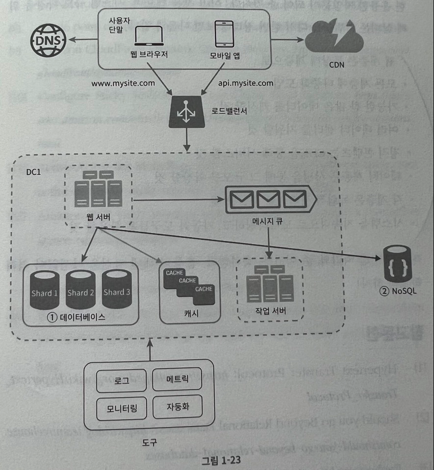

# 1장) 사용자 수에 따른 규모 확장성

## 단일서버

웹 - 앱 - 데이터베이스 - 캐시 등이 한 서버에서 동작

## 데이터베이스

웹/모바일 트래픽 처리용도의 서버(웹 계층)와 데이터베이스용 서버(데이터 계층)를 분리

- 독립적 확장 추구

**비-관계형(NoSQL) 데이터베이스가 좋은 선택일 수 있는 경우**

- 아주 낮은 응답 지연시간 필요
- 다루는 데이터가 비정형 데이터인 경우
- 데이터를 직렬화/역직렬화 할 수만 있으면 되는 경우
- 아주 많은 양의 데이터를 저장할 필요가 있는 경우

## 수직적 규모 확장 / 수평적 규모 확장

스케일 업 / 스케일 아웃

- 수직적 규모 확장(스케일 업)은 장애에 대한 자동복구 방안이나 다중화 방안을 제시하지 않음. 즉, 장애 발생 시 서비스 중단.

**로드 밸런서**

- 부하 분산 집합에 속한 웹서버에게 트래픽 부하 고르게 분산
- 로드밸런서를 public ip로 두고 내부에선 private ip로 이용 → 보안 위함.
- 자동복구 문제 해결 및 웹 계층 가용성 향상

**데이터베이스 다중화**

- 서버 사이에 주 - 부 관계를 설정하고 데이터 원본은 주 서버에, 사본은 부 서버에 저장하는 방식
- 부 데이터베이스는 읽기 연산만을 지원 → 일반적으로 읽기 연산이 트래픽이 대다수이므로 주 데이터베이스보다 수가 많아야 함.
- 주/부 데이터베이스 둘 다 정상인 경우 역할이 나뉘어져 있지만, 한 측의 데이터베이스가 사용 불가능하다면 다른 측의 데이터베이스가 다 커버하도록 설계됨.

## 캐시

캐시 계층은 데이터가 잠시 보관 되는 곳 → 메모리를 사용

- 좋은 성능 (빠름)
- 휘발성 → 영속성 보관 데이터가 의존해서는 안됨
- 만료 및 일관성 유지, 장애 등을 생각해서 사용되어야 함
    - 캐시 메모리 크기, Evition 정책 등도 설정 필요

**캐싱 전략**

- Cache-Aside
- Read-Through Cache
- Write-Through Cache
- Write-Around
- Write-Back
- ...

[Caching Strategies and How to Choose the Right One](https://codeahoy.com/2017/08/11/caching-strategies-and-how-to-choose-the-right-one/)

## 콘텐츠 전송 네트워크 (CDN)

정적 콘텐츠 저장 → 지리적 분산 서버 네트워크

CDN 사용 시, 고려 사항

- 비용: 제3 자에 의해 운영 → CDN 들어가고 나가는 데이터 전송 양에 따라 요금 지불
- 적절한 만료시간 설정: 만료기간이 중요한 콘텐츠의 경우, 만료시점 설정이 중요함
- CDN 장애 대처방안: CDN 죽었을 때, 어떻게 동작하는가에 대한 대책 필요
- 콘텐츠 무효화: 만료되지 않은 콘텐츠라도 무효화 할 수 있는 방안 필요
    - CDN 사업자가 제공하는 API, Object versioning (버저닝 ex] `image.png?v=2`) 등
    

## 무상태 웹 계층

웹 계층으로 수평적으로 확장 → 상태 정보(ex] 사용자 세션)를 웹 계층에서 제거

- 세션은 같은 클라이언트로부터의 요청이 항상 같은 서버로 전송되어야 함

상태 정보가 필요한 경우, 공유 저장소(shared storage)를 사용

- 웹 서버로부터 물리적으로 분리

## 데이터 센터

2개의 데이터 센터 사용 → 장애 없으면 사용자는 가장 가까운 데이터 센터로 안내됨

- 지리적 라우팅 (geoDNS-routing/geo-routing) 사용
- 만약 장애나면, 장애가 나지 않은 데이터 센터로 연결

이런 것처럼 다중 데이터 센터를 고려하는 경우, 몇 가지 고려해야하는 사항이 있음.

- 트래픽 우회: 올바른 데이터 센터로 트래픽을 보내는 법. GeoDNS 같이.
- 데이터 동기화: 센터마다 별도의 데이터베이스면, 동기화를 어떻게 할 것인가. 보편적으로 다중화함.

## 메시지 큐

메시지 큐에 일단 보관된 메세지는 소비자가 꺼낼 때까지 안전히 보관되는 특성

- 메시지의 무손실 및 비동기 통신 지원

메시지 큐를 사용하면 서버간 ‘느슨한 결합’을 이룰 수 있음

- 규모확장성 향상, 안정적 애플리케이션 구성 가능

물론, 메시지 큐를 사용하게되면 관리자가 관리해야할 컴포넌트가 늘어나는 것.

## 로그, 메트릭 그리고 자동화

로그

- 에러로그 모니터링 → 시스템/어플리케이션의 오류 및 문제 찾기 위함
- 검색 및 조회 기능 지원해야 편하다.

메트릭

- 시스템의 현재 상황 파악 , 사업 현황에 관한 유용한 정보
- 호스트 단위 메트릭: CPU, 메모리, 디스크 I/O 등
- 종합 메트릭: 데이터베이스 계층 성능, 캐시 계층 성능
- 핵심 비즈니스 메트릭: 일별 능동 사용자(DAU), 수익 등

자동화

- CI/CD
- 빌드/테스트/배포 절차 자동화 → 개발 생산성 향상

## 데이터베이스 규모 확장

수직적 확장 → 고성능 자원 증설

- 한계 존재
- 여전히 단일이기에 SPOF 무시할 수 없음
- 비용 비쌈

수평적 확장 → 샤딩

- 한계 없음
- 데이터를 어떻게 분산시키는가가 가장 중요함.
- 데이터 분산을 고려하다보니 시스템 자체가 복잡해지고, 여러 문제가 발생함.
- 이전에 정리했던 [consistent hashing](https://binux.tistory.com/119)도 이러한 문제로 고안되었음

---

## 1장 마무리

결국 위 모든 것들을 고려하면 다음과 같은 아키텍처가 될 것

