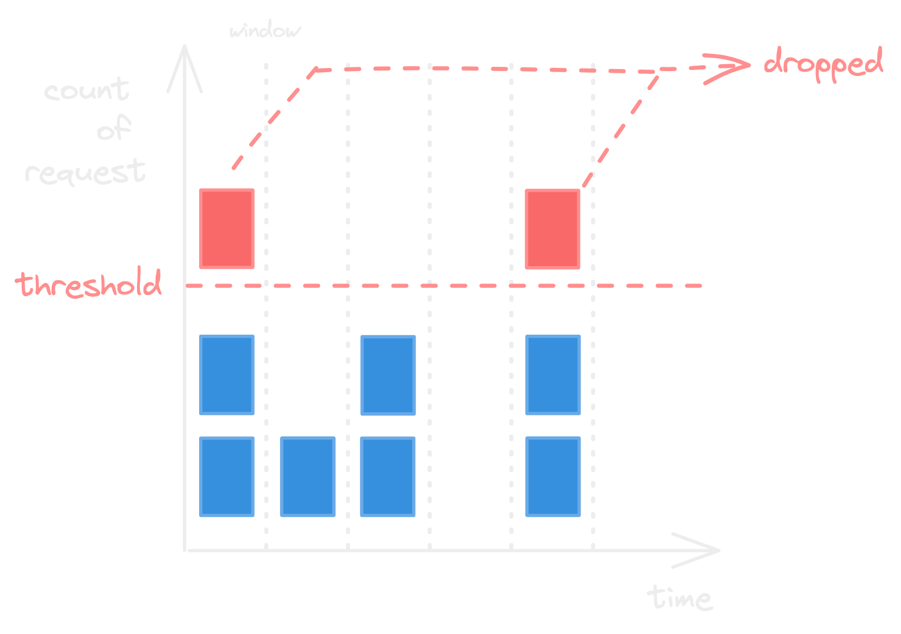
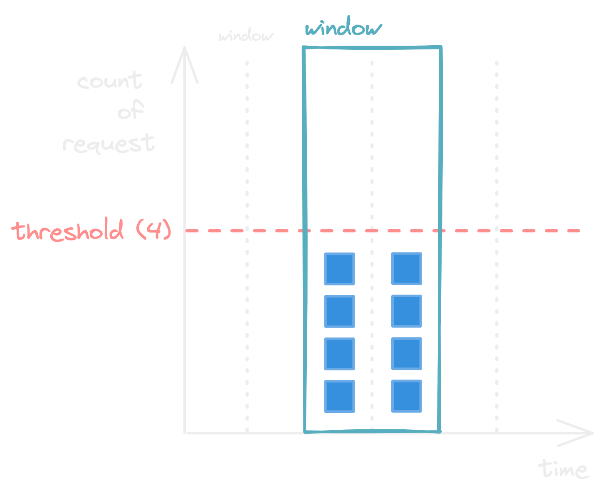
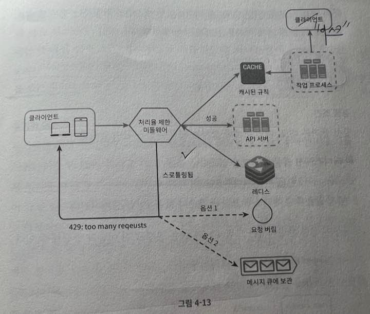

# 4장) 처리율 제한 장치의 설계

# 정의

처리율 제한 장치 (`Rate Limiter`)

- 클라이언트 또는 서비스가 보내는 트리팩의 처리율을 제어하기 위한 장치
- 정의된 임계치(Threshold)를 넘어서면 추가로 도달한 모든 호출은 처리가 중단
- Ex)
    - 사용자는 초당 2회 이상의 새 글을 올릴 수 없다.
    - 같은 IP 주소로는 하루에 10개 이상의 계정을 생성할 수 없다.
    

# 처리율 제한 장치는 왜 사용하는가?

- DoS(`Denial of Service`) 공격에 의한 자원 고갈(`Resource Starvation`)을 방지할 수 있다.
- 비용을 절감할 수 있다. 처리를 제한해 서버를 많이 두지 않고, 우선순위가 높은 API에 더 많은 자원을 할당할 수 있다. 특히 요청 당 비용이 드는 Third party API를 사용하고 있는 경우, 횟수 제한을 통해 과도한 비용을 막을 수 있다.
- 서버 과부하를 막는다. 봇, 크롤러 등에서 오는 잘못된 이용 패턴으로 유발된 트래픽을 제한한다.

- [생각] Rate limiter를 어디서 들어봤지?
    - Resilience4j 학습 시, 제공되고 있는 RateLimiter 모듈이 존재했음
        - [https://resilience4j.readme.io/docs/ratelimiter](https://resilience4j.readme.io/docs/ratelimiter)
    - Istio rate limit → envoy
        - [https://istio.io/latest/docs/tasks/policy-enforcement/rate-limit/](https://istio.io/latest/docs/tasks/policy-enforcement/rate-limit/)
        - https://github.com/envoyproxy/ratelimit

# 1단계, 문제 이해 및 설계 범위 확정

- 클라이언트 측 제한 장치인가? 서버 측 제한 장치인가?
- 어떤 기준을 통해 호출을 제한하는가? 어떤 제어 규칙을 사용하는가?
- 시스템 규모는 어떻게 되는가?
- 분산된 환경을 고려해야하는가?
- Rate Limiter가 독립된 서비스로 동작하는가? 서비스 코드에 포함되는가?
- 제한된 경우, 클라이언트에게 알려주어야 하는가?

## 고려해야 할 요구사항

- 처리율 초과하는 요청은 정확하게 제한
- 낮은 응답시간: 응답시간에 나쁜 영향을 주면 안됨
- 가능한 적은 메모리 사용
- 분산형 처리율 제한: 분산형 구조에서 Rate limiter 또는 현재 상황을 공유할 수 있어야 함
- 예외 처리: 요청이 제한된 경우, 클라이언트가 알 수 있어야 함
- 높은 Fault tolerance: 제한 장치에 장애가 생겨도, 전체 시스템에 영향을 주면 안됨

# 2단계, 개략적 설계안 제시 및 동의 구하기

## 처리율 제한 장치는 어디에 둘 것인가?

- 클라이언트?
    - 별로 좋지 않다. 위변조 가능, 모든 클라이언트 구현 어려움, ...
- 서버
    - 서버에 붙여두는 것
- 미들웨어
    - 요청이 서버에 들어가기 이전 미들웨어에서 먼저 통제
    - 제한된 요청이라고 판단되면 서버에 안보내고, 미들웨어 단에서 [HTTP 429 (Too many requests)](https://developer.mozilla.org/en-US/docs/Web/HTTP/Status/429) 반환
    - Cloud MSA 구조에서 보통 API Gateway를 활용 → Rate limiter, SSL termination, User Authentication, IP Whitelist 등 지원

서버/미들웨어 어디에 둘 것인가는 정답 없음

- 하지만 어디에 둘 것인가를 결정할 때 고려해야할 점은 있음
    1. 프로그래밍 언어, 캐시 서비스 등 기술 스택 점검 → 현재 서버 측 언어를 통해 구현이 가능한가? 충분한가?
    2. 현재 비즈니스에 맞는 처리율 제한 알고리즘 찾기 → 미들웨어 및 제 3자가 서비스하는 Gateway를 사용한다면 적절한 알고리즘이 있는지 확인.
    3. MSA 구조를 사용하고 있어 이미 API Gateway 사용하고 있다면, 기존 API Gateway에 Rate limiter 포함시키는 것 고려
    

## 처리율 제한 알고리즘

- 토큰 버킷 (Token bucket)
- 누출 버킷 (Leaky bucket)
- 고정 윈도 카운터 (Fixed window counter)
- 이동 윈도 로그 (Sliding window log)
- 이동 윈도 카운터 (Sliding window counter)

### 토큰 버킷 알고리즘

- 지정된 용량을 갖는 컨테이너인 토큰 버킷.
- 토큰 공급기(refiller)에 의해 사전 설정된 양의 토큰이 주기적으로 채워짐. 버킷이 가득 차면 추가로 공급된 토큰은 버려짐.
- 각 요청은 처리될 때마다 하나의 토큰을 사용. 즉, 요청이 도착하면 버킷에 충분한 토큰이 있는지 검사. 토큰이 없으면 해당 요청은 버려짐(dropped)

2개의 파라미터

- 버킷 크기: 버킷에 담을 수 잇는 토큰의 최대 개수
- 토큰 공급률(refill rate): 초당 몇 개의 토큰이 버킷에 공급되는가

장점

- 구현이 쉬움. 메모리 사용측면에서도 효율적.
- `Burst of traffic` 의 경우에도 처리가 가능. 버킷에 남은 토큰이 있기만 하면 요청은 시스템에 전달 될 것.

단점

- 파라미터를 비즈니스 및 상황에 맞게 적절히 튜닝해야 하는 것이 까다로움.

### 누출 버킷 알고리즘

- 토큰 버킷과 비슷하지만, **요청 처리율이 고정되어 있다는 점**의 차이가 있다.

보통 FIFO 큐로 구현해 사용한다.

- 요청이 도착하면 큐가 가득 차 있는지 확인
- 빈자리가 있으면, 요청을 큐에 추가
- 빈자리가 없으면, 요청을 버림
- 지정된 시간마다 큐에서 요청을 꺼내어 처리

2개의 파라미터

- 버킷 크기: 큐 사이즈 값
- 처리율(outflow rate): 지정된 시간 당 몇 개의 항목을 처리할 것인가? (보통 초 단위)
- (책에서는 보통 초 단위라고 하지만, 시간 단위도 파라미터로 받을 수 있을 것 같다)

장점

- 큐의 크기가 제한되어있어 메모리 사용량에서 효율적
- 고정된 처리율 → 안정적 출력(stable outflow rate)이 필요한 경우 적합

단점

- 단시간에 트래픽이 몰리는 경우(`Burst of traffic`), 큐에는 오래된 요청이 쌓임 → 제때 처리 못하면 최신 요청들 버려짐
- 토큰 버킷과 마찬가지로 튜닝하는게 까다로울 수 있다.

### 고정 윈도 카운터 알고리즘

- 타임라인을 고정된 간격의 윈도로 나누고, 윈도마다 카운터를 붙임.
- 요청마다 카운터를 1씩 증가시킨다. 카운터의 값이 임계치(threshold)에 도달하면 새로운 요청은 새 윈도가 열릴 때까지 버려짐.
    - 위 예시 사진은 threshold가 2인 경우
- 새 윈도가 열리면 카운터를 초기화

이 알고리즘에는 큰 문제가 존재

- 윈도의 경계 부근에서 순간적으로 많은 트래픽이 발생할 시, 특정 시간 단위에 할당된 양보다 더 많은 요청이 처리될 수 있다.
- 사진의 경우를 보자. window는 분 단위이며 window(분) 당 threshold가 4인 상황이라고 하자. 윈도우 경계 부분에 순간적으로 많은 요청이 들어온 상황. 고정된 window에는 위반하지 않아 모든 요청이 잘 처리되겠지만, 사실 따지고 보면 분당 8개의 요청을 처리하게 될 수 있다.

장점

- 메모리 효율이 좋다. 이해하기 쉽다.
- 윈도가 열릴 때 카운터가 초기화되는 방식은 특정 트래픽 패턴을 처리하기 적합함

단점

- 위에서 설명한 문제처럼 윈도 경계부분에 요청이 몰리면, 제한하고 싶은 한도보다 많은 요청을 처리할 수 있음

### 이동 윈도 로깅 알고리즘

고정 윈도 카운터 알고리즘의 문제를 해결하기 위해 고안

- 요청의 타임스탬프를 추적. 타임스탬프 로그를 레디스 또는 정렬 집합 같은 캐시에 저장
- 새 요청이 왔을 때, 캐시에 저장된 타임스탬프 중 만료된 타임스탬프는 제거.
- 새 요청의 타임스탬프를 로그(캐시)에 추가.
- 로그의 양이 허용치보다 같거나 작으면 요청을 수행. 허용치보다 많은 경우, 요청 처리 거부.

장점

- 처리율 제한 매커니즘이 아주 정교함 → 어느 순간의 윈도를 보더라도 허용되는 요청의 개수는 시스템 처리율 한도를 넘지 않을 것

단점

- 다량의 메모리가 필요. 거부된 요청의 타임스탬프도 보관함.
    - 왜 거부된 요청의 타임스탬프를 저장할까?

### 이동 윈도 카운터 알고리즘

고정 윈도 카운터 알고리즘과 이동 윈도 로깅 알고리즘을 결합.

- 현재 윈도우와 현재 시간을 보고, 들어온 요청의 비율을 따져서 처리할지 판단하는 알고리즘.
    - ex) 윈도우 크기 1분
        - `현재 1분간의 요청 수 + 직전 1분간의 요청 수 * 이동 윈도(현재 요청으로부터 1분 간)와 직전 1분이 겹치는 비율`
    - 다양한 알고리즘이 있음

장점

- 이전 윈도의 평균 처리율과 현재 윈도 상태를 측정해 계산하므로 짧은 시간에 몰리는 트래픽에도 잘 대응

단점

- 직전 윈도(시간)에 도착한 요청이 균등하게 분포되어있다고 가정하고 위와 같은 식을 사용. 이것도 경계 부분에 몰렸을 경우, 계산이 예상한 결과와 다르게 동작할 수 있음. 근데 클라우드플레어에서 수행한 실험에 의하면 이런 경우는 0.003%에 불과했다고 함.

## 카운터는 어디에 저장할 것인가?

메모리상에서 동작하는 캐시가 바람직할 것

- 빠르고, 시간에 기반한 만료 정책을 지원.
- Redis → `INCR`, `EXPIRE` 명령어 지원
    - `INCR`: 메모리에 저장된 카운터 1증가
    - `EXPIRE`: 카운터에 저장한 타임아웃 값 설정 → 만료되면 자동으로 삭제
    

# 3단계, 상세 설계

## 처리율 한도 초과 트래픽의 처리

- HTTP 429 응답(Too many requests)
- 경우에 따라 한도 제한이 걸린 메시지를 나중 처리를 위해 큐에 보관

### 처리율 제한 장치가 사용하는 HTTP Header

- `X-Ratelimit-Remaining`: 윈도 내 남은 처리가능 요청 수
- `X-Ratelimit-Limit`: 매 윈도마다 클라이언트가 전송할 수 있는 요청의 수
- `X-Ratelimit-Retry-After`: 한도 제한에 걸리지 않으려면 몇 초 뒤에 요청을 보내야하는 지 알림

[https://tools.ietf.org/id/draft-polli-ratelimit-headers-00.html#rfc.section.3](https://tools.ietf.org/id/draft-polli-ratelimit-headers-00.html#rfc.section.3)

## 상세 설계

- 처리율 제한 규칙 디스크에 저장 → 작업 프로세스가 수시로 규칙을 디스크로부터 읽어 캐시에 저장
- 클라이언트가 요청을 보내면 Rate limiter 미들웨어가 받음
- Rate limiter 미들웨어는 규칙을 캐시로부터 읽어와 카운터 또는 타임스탬프를 Redis 캐시에서 가져옴. 가져온 값들에 근거해 요청을 처리.
    - 처리율 제한에 걸리지 않은 경우, API 서버로 전송
    - 처리율 제한에 걸린 경우, Http status 429 등 헤더 정보를 설정해 클라이언트에게 전송.
        - 요청을 버릴 수도 있고, 큐에 등록해놓고 나중에 처리할 수도 있음

## 분산환경에서의 처리율 제한 장치 구현

### 경쟁 조건 (Race condition)

카운터를 사용한다고 했을 때, 분산환경에서 동시에 카운터 값에 접근하여 업데이트를 하다보면 경쟁 조건 이슈가 발생할 수 있다.

경쟁 조건 문제를 해결할 수 있는 가장 쉬운 방법은 Lock이지만, 성능 이슈가 커진다. 이를 해결할 수 있는 다른 방안은 루아 스크립트와 정렬집합 레디스 자료구조이다.

### 동기화 (Synchronization)

- 처리율 제한 장치 서버를 여러 대 두게 되면 동기화가 필요해짐.
    - 이 상황에서 웹 계층은 기본적으로 무상태이기 때문에 한 클라이언트라도 요청이 각기 다른 처리율 제한장치로 갈 수 있음.
    - A 처리율 제한 장치는 요청이 허용되고, B 처리율 제한 장치는 요청이 거부될 수도 있음.
- Redis 같은 중앙 집중형 데이터 저장소를 사용해서 해결

### 성능 최적화

에지 서버 사용

### 모니터링

처리율 제한 장치가 효과적으로 동작하고 있는가 확인?

2개의 측면에서 모니터링 해야함.

- 채택된 처리율 제한 알고리즘이 효과적인가?
- 정의한 처리율 제한 규칙(파라미터)이 효과적인가?

# 4단계, 마무리

다음과 같은 부분도 생각해보기

- 경성 또는 연성 처리율 제한
    - 경성(Hard): 요청의 개수는 임계치를 절대 넘을 수 없음.
    - 연성(Soft): 요청의 개수는 잠시동안 임계치를 넘을 수 있음.

- 다양한 계층 처리율 제한
    - HTTP? IP?

- 처리율 제한 회피 방법? 클라이언트 설계 방법?
    - 캐시를 사용해 API 호출 횟수를 줄임
    - 클라이언트가 처리율 제한 임계치 이해
    - 처리율 제한이 되었을 때, 클라이언트 Gracefully 복구 고려
    - Retry 로직 → 충분한 back-off
        - [https://projectreactor.io/docs/core/release/reference/#faq.exponentialBackoff](https://projectreactor.io/docs/core/release/reference/#faq.exponentialBackoff)
        - [https://projectreactor.io/docs/core/release/api/reactor/util/retry/Retry.html#backoff-long-java.time.Duration-](https://projectreactor.io/docs/core/release/api/reactor/util/retry/Retry.html#backoff-long-java.time.Duration-)
        - [https://medium.com/@odysseymoon/spring-webflux에서-error-처리와-retry-전략-a6bd2c024f6f](https://medium.com/@odysseymoon/spring-webflux%EC%97%90%EC%84%9C-error-%EC%B2%98%EB%A6%AC%EC%99%80-retry-%EC%A0%84%EB%9E%B5-a6bd2c024f6f)