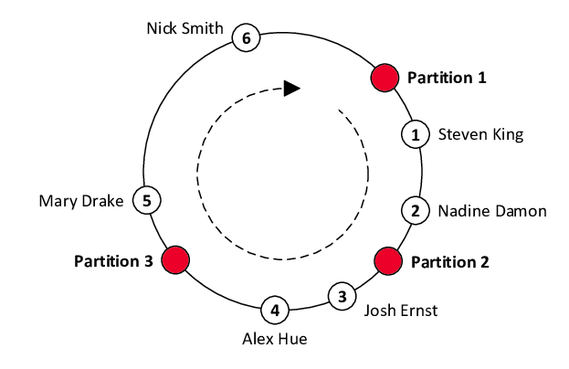
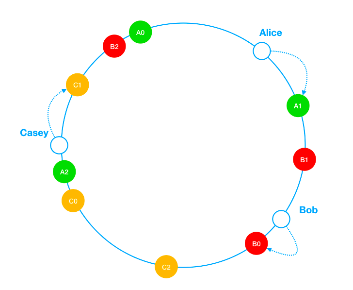

# 5장. 안정 해시 설계

## 해시 키 재배치(rehash) 문제
* N개의 캐시 서버가 있다고 할 때, 이 서버들에 부하를 균등하게 나누는 보편적인 방법은 아래와 같은 해시 함수를 사용하는 것이다.
```text
serverIndex = hash(key) % N
```
### 위와 같은 방법의 단점
* 서버 풀의 개수가 고정되어 있을 때에나 부하를 균등하게 나눌 수 있다.
> 만약 한 서버에 이상이 발생하여 서버 풀의 개수가 줄어들거나, 트래픽이 몰려서 서버 풀의 개수를 늘려야 한다면?
* 해당 서버에 존재하던 해시키가 사라고, 엉뚱한 서버로 접근하게 되어 대규모 캐시 미스가 발생하게 되므로 대량의 리밸런싱이 이루어져야 한다.

## 안정 해시 (Consistent Hash)
* 안정 해시는 해시 테이블의 크기가 조정될 때 평균적으로 k/n개의 키만 재배치하는 해시 기술이다. (k = 키의 개수, n = 슬롯 개수)
* 키의 위치에서 링을 시계 방향으로 탐색하다 만나는 최초의 서버가 키가 저장될 서버다.
* 레디스의 데이터를 어플리케이션 레이어에서 분산 시킬 때 사용할 수 있다. ([영상 링크](https://youtu.be/mPB2CZiAkKM?t=3580) 참고)

* 키가 저장되는 서버는 해당 키의 위치로부터 시계 방향으로 링을 탐색해 나가면서 만나는 첫 번째 서버다.
  * Nick Smith 는 Partition 1
  * Steven King 은 Partition 2

#### 서버 추가
* 서버를 중간에 추가하여 Partition 4가 생겼을 경우
  * Partition 4의 위치가 Mary Drake 와 Nick Smith 의 사이에 위치하게 될 경우, 리밸런싱은 Mary Drake 만 이루어지면 된다.

#### 서버 제거
* Partition 3이 제거된 경우
  * Alex Hue와 Josh Ernst만 Partition 1로 리밸런싱되면 된다.

### 안정 해시의 문제점
* 서버가 추가되거나 삭제될 때, 리밸런싱이 이루어지면서 해당 서버에 키가 집중되기 때문에 파티션의 크기를 균등하게 유지하는 것이 불가능하다.
* 특정 상황에 따라 키가 균등하게 분포되지 않을 수도 있다.

## 가상 노드 (Virtual Node)
* 가상 노드는 실제 노드 또는 서버를 가리키는 노드로서, 하나의 서버는 링 위에 여러 개의 가상 노드를 가질 수 있다.
* 가상 노드의 개수를 늘리면 표준 편차가 작아져서 키의 분포도는 점점 균등해진다.
  * 100~200개의 가상 노드를 사용했을 경우 표전 편차 값은 평균의 5%(가상 노드가 200개인 경우)에서 10%(가상 노드가 100개인 경우) 사이다.
* 가상 노드이 개수를 더 늘리면 표준 편차의 값은 더 떨어지지만 가상 노드 데이터를 저장할 공간이 더 많이 필요해지게 된다.

[참고](https://liuzhenglaichn.gitbook.io/system-design/advanced/consistent-hashing)