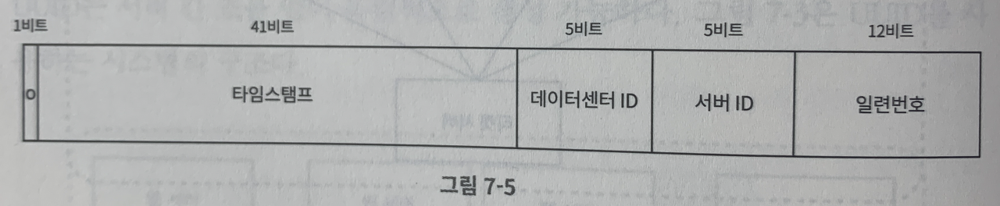

# 7장. 분산 시스템을 위한 유일 ID 생성기 설계 

## auto increment 속성의 PK로는 분산된 DB 환경에서 유일성을 보장하기 어렵다
- 동시에 동일한 ID를 생성하게 되면 중복키 발생
---

## 문제 정의(요구사항)
- ID는 유일하고 정렬가능해야 한다
- ID는 64비트로 표현될 수 있는 값이어야 한다  
- 시간 순서에 따라 나중에 만든 값이 더 커야 한다 
- 숫자로만 구성되야 한다
- 초당 10,000 ID 를 생성할 수 있어야 한다   
---
## 다중 마스터 복제
- 특징 
  1. DB의 auto increment 기능을 활용하는 것 
  2. 다만 다음 ID를 구할 때 1만큼 증가시키지 않고 k 만큼 증가시킨다.
  3. 간단하게 적용할 수 있는 방식이고, 한 데이터 센터에서 어느정도 확장도 가능하다

- 단점
  1. 여러 데이터 센터에 걸쳐 규모를 늘리기 어렵다.
  2. ID의 유일성은 보장되겠지만, 그 값이 시간 흐름에 맞추어 커지도록 보장할 수는 없다
  3. 서버를 추가하거나 삭제할 때도 잘 동작하도록 만들기 어렵다
     - k가 고정되고 나면 서버 수에 따라 애매해지기 때문
--- 
## UUID
- 특징
  1. 128비트의 UUID를 활용. 서버간의 조율 없이 독립적으로 생산 가능하다
  2. 발급 하고 바로 사용하면 되기 때문에 단순하다. 동기화 이슈도 없다. 규모 확장도 용이하다
     - ?? 웹 서버 마다 ID 생성기가 있으면 충돌할 수 있는 확률이 높아지지 않는지?

- 단점
  1. 128비트로 용량이 조금 크다 (요구사항에서는 64비트로 제한이 걸려 있다)
  2. ID를 시간순으로 정렬할 수 없다. (책에서 나왔지만 정렬가능한 UUID로 만드는 방법이 있다)
     - 타임 스탬프를 통한 정렬가능한 ID로 생성하는 라이브러리들은 있다
  3. ID에 숫자가 아닌 값이 포함될 수 있다. (구현하기 나름인듯)
--- 
## 티켓 서버
- 특징
  - 다중 마스터 복제와 유사하게 DB의 auto increment를 활용하지만 티켓 서버를 중앙 집중형으로 하나만 사용하는 방법

- 장점
  - 유일성이 보장되는 오직 숫자로만 구성되는 ID를 쉽게 만들 수 있다. 구현하기 쉽고, 중소 규모 애플리케이션에도 적합하다.

- 단점
  - 티켓 서버가 SPOF가 된다
    - 이를 해결하려고 여러개의 타겟서버를 두면 데이터 동기화 이슈가 생긴다 
---
## 트위터 snowflake (요구사항에 가장 적합)
- 특징
  - 64비트 내에서 적절한 비트 단위로 정보를 기록하는 기법
  - 생성해야 하는 ID 구조를 여러 절(section)로 분할하는 방법 
  

- 각 비트의 쓰임새는 다음과 같다.
  - 1비트 - 사인비트, 쓰임새가 현재는 없지만 나중을 위해 유보. 음수 양수를 구분할 수 있을 것이다
  - 41비트 - 타임스탬프, 기원 시각 이후 millisecond 단위로 값을 표현한다. 총 41비트 이므로 약 69년을 cover할 수 있고 기원 시각 이후 69년이 지나면 migration 또는 기원시각 조정이 필요하다
  - 5비트 - 데이터 센터 ID로 총 32개의 데이터 센터를 지원할 수 있다
  - 5비트 - 서버 ID, 한 데이터 센터당 32개의 서버를 지원할 수 있다.
  - 12비트 - 일련번호 - 각 서버에서는 ID를 생성할 때마다 일련번호를 1만큼 증가시키고, 이 값은 1밀리초 기준으로 0으로 초기화 시킨다 (그러면 타임스탬프가 바뀌게 되어 구분할 수 있다)

### 설계상 주안점 
- 타임 스탬프 
  - 시간순으로 정렬하기 위한 방법(타임 스탬프는 시간 흐름에 따라 점점 큰 값을 가짐)
    - ?? 이 경우 max 숫자에 대한 문제는 없는가?? 
      - 이것을 해결 하기 위해 기원이 되는 시작 시간을 초기화 해서 다시 적용하는 것을 얘기하는데 
      - 69년이라는 세월은 결국 68년차에 이것을 맞닫드리는 사람이 해결 할 것으로 보임 

- 일련번호 
  - 일련번호는 12비트 이므로 4096개를 만들 수 있으나 어떤 서버가 같은 밀리초 동안 하나 이상의 ID를 만든 경우에만 0보다 큰 값을 갖게 한다 
    - 즉 1밀리초 동안은 유일한 번호를 부여하려는 의도로 보인다 

---
## 마무리 
- 시계 동기화
  - ID 생성 서버들은 OS 타임이 동기화되어 있어야 한다.
  - NTP(Network Time Protocol)은 이 문제를 해결하는 가장 보편적인 수단이다.

- 비트 별 section 의 최적 화 
  - 예를 들어 동시성이 낮고 수명이 긴 애플리케이션이라면 일련번호 절을 줄이고 타임 스탬프 절의 길이를 늘리는 사이즈에 대한 수정을 할 수 있다 

- 고가용성이 보장되는지의 부분은 항상 기억하자 