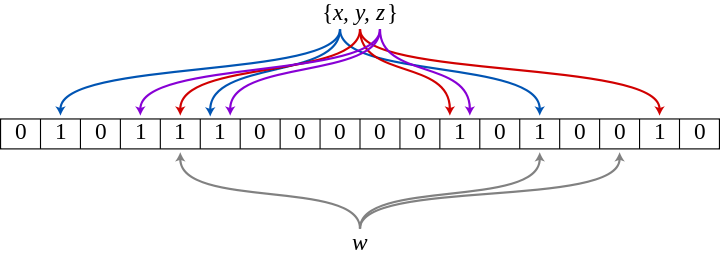

# 8장 URL 단축기 설계

---

# 1단계 - 문제 이해 및 설계 범위 확정

- 쓰기 연산: 매일 1억개의 단축 URL 생성
    - 초당 쓰기 연산: `1억/24/3600 = 1160`
- URL 단축 서비스 10년간 운영 가정: `1억 * 365 * 10 = 3650억` 개의 레코드를 보관해야 함
- 축약 전 URL 평균 길이 100 byte
    - 즉, 10년 동안 필요한 저장 용량은 `3650 * 100 = 36.5TB`

  

# 2단계 - 개략적 설계안 제시 및 동의 구하기

## API 엔드포인트

URL 단축기는 기본적으로 2개의 엔드포인트를 필요로 한다.

1. URL 단축용 엔드포인트
- 새 단축 URL을 생성하고자 할 때, 단축할 URL을 인자로 넣어 POST 요청

1. URL 리다이렉션 엔드포인트
- 단축 URL에 대해 HTTP 요청이 오면 원래의 URL로 보내주기 위해 리다이렉션 URL 반환

## URL redirection

HTTP에서 Redirection에 관한 status, header를 제공한다.

### **[301 Moved Permanently](https://developer.mozilla.org/ko/docs/Web/HTTP/Status/301)**

> 요청한 리소스가 [Location](https://developer.mozilla.org/en-US/docs/Web/HTTP/Headers/Location) 헤더에 주어진 URL로 완전히 옮겨졌다는 것을 나타낸다. 브라우저는 이 페이지로 리다이렉트하고, 검색 엔진은 해당 리소스로 연결되는 링크를 갱신한다.
검색엔진 최적화의 관점에서는 '원 콘텐츠가 새로운 URL로 옮겨졌다'(the link-juice is sent to the new URL)고 한다.
> 

- 영구적으로 이전 되었음으로 브라우저에서는 이 응답을 캐시한다. 즉, 단축 URL로의 request를 받았을 때 캐시된 데이터가 있다면, 브라우저는 원래 URL로 요청을 보내게 된다.
- 단축 URL 서버 부하를 줄이고 싶은 경우, 301을 사용하는 것이 좋을 수 있다.

### **[302 Found](https://developer.mozilla.org/ko/docs/Web/HTTP/Status/302)**

> 요청한 리소스가 [Location](https://developer.mozilla.org/en-US/docs/Web/HTTP/Headers/Location) 헤더에 주어진 URL에 일시적으로 이동되었음을 가리킨다. 브라우저는 사용자를 이 URL의 페이지로 리다이렉트시키지만 검색 엔진은 그 리소스가 일시적으로 이동되었다고 해서 그에 대한 링크를 갱신하지는 않는다.
'SEO 관점' 에서 말하자면, 링크 주스(Link Juice)가 새로운 URL로 보내지지는 않는다.
> 

- 일시적으로 이전 됬음을 나타내므로 캐시되지 않는다. 즉, 단축 URL로의 request는 언제나 단축 URL 서버로 보내진 뒤 원래 URL로 redirection 될 것이다.
- 트래픽 분석 등 단축 URL 서버에서 모든 요청을 받아보는 것이 유의미한 경우, 302를 사용하는 것이 좋을 수 있다.

URL redirection을 구현하는 갖아 직관적인 방법은 해시 테이블을 사용하는 것이다.

- 단축 URL → 원래 URL

## URL 단축

URL을 단축시키는데 해시함수 사용

- 중요한 것은 어떤 해시 함수를 사용할 것인가

요구사항

- URL이 다르면, 당연히 해시 값도 달라야 한다.
- 해시 값은 원래의 URL로 복원될 수 있어야 한다.

  

# 3단계 - 상세 설계

## 데이터 모델

개략적 설계 때는 원래 URL, 단축 URL을 해시 테이블에 구성

- 양 많아지면 당연히 무리(유한/비쌈😢) → RDB에 저장

## 해시 함수

### 해시 값 길이

단축 URL은 알파벳과 숫자로만 이루어져야한다는 요구사항

- [0-9, a-z, A-Z]. 즉, 62개의 문자를 사용할 수 있다.

### **hashValue(단축 URL)의 길이는 몇으로 정할까?**

- hashValue의 길이를 정하기 위해서는 `62^n >= 3650억` 에서의 n의 최소값을 찾아야 함.
- n이 7이면 3.5조개의 URL 만들 수 있음 → hashValue의 길이를 7로 결정

### 해시 함수 구현 #1] 특정 해시 함수 사용 → 충돌 해결

원래의 URL을 7글자로 줄이는 해시함수 필요

- 책에서는 `CRC32`, `MD5`, `SHA-1` 함수 언급 → 하지만 모두 결과가 7글자보단 길다.

해시함수의 결과에서 앞자리 7개만 사용하자

- 충돌난 경우, 미리 사전에 정의해 둔 문자열을 원래의 URL에 추가해 다시 해시함수를 돌리자. 충돌나지 않을 때까지 반복.
- 충돌나는지 여부를 확인하기 위해 원래의 URL과 단축 URL을 저장한 DB에 쿼리를 날려야 함 → 작업 당 한번 이상의 쿼리는 무조건 발생 → 오버헤드가 크다.
- 블룸 필터를 사용 - 어떤 집합에 특정원소가 있는지 검사
    
    
    
    - [http://www.secmem.org/blog/2019/05/17/bloom-filter/](http://www.secmem.org/blog/2019/05/17/bloom-filter/)

### 해시 함수 구현 #2] base-62 사용

hashValue에 사용할 수 있는 문자가 62개이기 때문에 사용.

따로 본래의 값을 해시함수에 넣어 결과를 가져오는 것이 아니라 ID 값을 base-62로 변환해 해당 값을 단축 URL로 사용하는 것.

- 즉, 유일성 보장 ID 생성기[7장]가 필요.

유일성 보장 ID를 단순히 전환하는 것이기에 충돌날 염려는 없다. 하지만, ID가 1씩 증가해 다음 단축 URL이 예측이 되는 보안적인 문제가 발생할 수 있고, 유일성 보장 ID가 길어짐과 비례해서 단축 URL 길이가 길어진다.

## URL 단축기 상세 설계 (base-62 사용)

1. 원래의 URL 입력
2. DB에 원래의 URL이 존재하는가 확인 (단축된 URL이 만들어진 적이 있는가?)
3. 없다면, 새로운 ID를 생성 (유일성 보장 ID)
4. 생성된 ID를 단축 URL로 변환
5. 원래의 URL, 단축 URL을 DB에 저장 및 반환

  

# 4단계 - 마무리

더 논의해보면 좋을 내용

- 처리율 제한 장치[4장]의 사용
    - 엄청난 양의 단축 요청으로 무력화될 수 있음
    - IP 주소 등을 통해 필터링해서 앞단에서 요청을 걸러내자.
- 웹 서버/데이터베이스 규모확장
    - 웹 서버: 스케일 아웃
    - 데이터베이스: 다중화 또는 샤딩
- 데이터 분석 솔루션 사용
    - 302 → URL 단축 서버로 요청을 받을 수 있음
    - 어떤 링크를 얼마나 많은 사용자가 선택했는지? 언제 주로 클릭했는지? 등 확인 가능