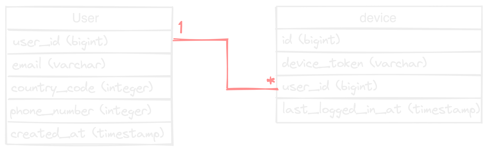
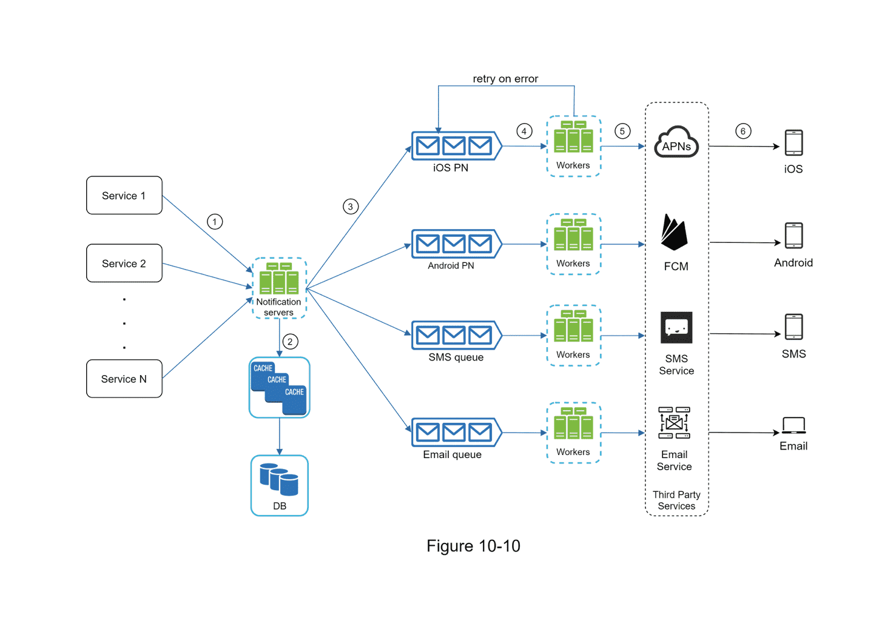
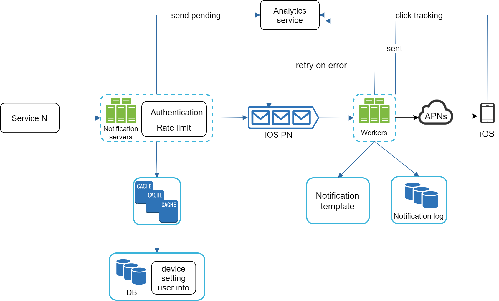

# 10장) 알림 시스템 설계

알림 시스템은 단순히 모바일 푸시 알림에 한정되지 않음.

- 책에서는 모바일 푸시 알림, SMS 메시지, 이메일 3가지로 분류함.

 

# 1단계, 문제 이해 및 설계 범위 확정

질문을 통한 설계 범위 확정

Q) 어떤 종류의 알림 ?

- 푸시 알림, SMS 메시지, 이메일
- iOS, Android, Laptop/Desktop 지원해야 함

Q) 실시간 시스템인지?

- 연성 실시간 시스템 (Soft real-time)
- 가능한 빨리 전달되어야 하지만, 요청이 몰린 경우 약간의 딜레이 허용

Q) 사용자가 알림을 받지 않는 옵션이 존재하는지?

- 사용자가 알림을 허용하지 않으면 알림을 받지 않음

Q) 하루에 몇 건의 알림?

- 천만 건의 모바일 푸시
- 백만 건의 SMS 메시지
- 5백만 건의 이메일

 

# 2단계, 개략적 설계안 제시 및 동의 구하기

## 알림 유형별 지원 방안

**iOS 푸시 알림**

- 알림 제공자 → APNS → iOS 단말기

- 알림 제공자
    - 알림 요청을 만들어 APNS로 보내는 주체
    - 단말토큰, 페이로드 데이터 필요
- APNS: 애플이 제공하는 원격 서비스, 푸시 알림을 iOS 단말로 보냄

**안드로이드**

- 알림 제공자 → FCM (Firebase Cloud Messaging) → 안드로이드 단말

**SMS 메시지**

- 알림 제공자 → SMS 서비스 (네이버, NHN, 가비아 등) → SMS 수신 단말

**이메일**

- 알림 제공자 → 이메일 서비스 (Sendgrid, Mailchimp, 네이버, 구글 등) → 이메일 수신 단말

 

## 연락처 정보 수집 절차

설계에서는 한 사용자가 여러 단말을 가질 수 있고, 알림은 모든 단말에 전송되어야 한다는 점을 고려함.

결국, 계정 등록시 사용자의 정보를 아래와 같은 형태로 받게 설계함.

 

## 알림 전송 및 수신 절차

**개략적 설계**

- 알림을 요청하는 N개의 서비스 존재 → 크론잡 또는 마이크로서비스 등 일 수 있다.
- 알림 시스템은 알림 전송을 위한 API를 제공해야 하며, 제3자 서비스에게 전달할 알림 페이로드를 만들어낼 수 있어야 함.
- 제3자 서비스는 사용자에게 알림을 실제로 전달하는 역할 (대부분 외부 툴) → 설계 시, 확장성을 염두해야 함. 쉽게 서비스를 추가/수정/삭제 할 수 있도록 설계 필요.

이 개략적 설계에서는 알림 서비스가 하나의 컴포넌트로 존재하며 여러 문제를 유발 할 수 있음.

- SPOF, 규모 확장성(DB, cache 확장 불가), 성능병목 등

 

**개선된 설계**

- DB, Cache를 서버에서 분리
- 알림 서버 증설 → Scale out이 가능하도록 구성
- MQ 이용 → 시스템 컴포넌트 간 의존도를 줄임

위의 구조에서 알림 서버(Notification server)는 다음 기능 제공

- 알림 전송 API, 알림 검증(validation), DB/Cache query, 알림 전송(to queue)

메시지 큐 사용

- 컴포넌트간 의존성 제거
- 다량의 알림이 전송되어야 하는 경우, 버퍼 역할도 가능
- 위 그림에서 왜 알림 종류마다 별도의 메세지 큐를 구성하였을까?
    - 책에서 말하길 하나에 장애가 발생해도 다른 종류의 알림을 정상 동작하도록 별도의 큐로 구현.
    - 사견)
        - 장애를 막기 위해 별도의 큐로 구현한다는 것은 아예 별도의 메세지 큐를 구성하여 활용한다는 것? ⇒ 오히려 관리해야 할 컴포넌트가 증가하는 것 아닐까?
        - 단일 메세지 큐로 두고 내부에서 여러 토픽을 나눠 활용하는 편이 오히려 깔끔할 것 같다는 개인적인 생각? 이렇게 되면 장애가 발생하면 문제가 생길 수 있지만, 알림 실패 재시도 로직을 추가해놓는다면 상관 없지 않을까?

 

# 3단계, 상세 설계

**데이터 손실 방지**

- 알림 시스템은 알림 데이터를 DB에 보관하고 재시도 메커니즘을 구현해야 함.
- 알림 로그를 DB에 유지하는 것도 하나의 방법 → 이를 사용하여 재시도 메커니즘?

**재시도 방지**

- 작업 서버에 보내야 할 알림이 도착하면 이벤트 ID를 검사하여 이전에 보낸 적이 있는지 확인
    - 알림 로그를 사용
    - 계속해서 DB/Cache query? ⇒ 1차적으로 Bloom filter를 이용해 query 전 확인?

**알림 설정**

- 사용자가 알림 설정으 상세히 조절할 수 있도록 `알림 설정 테이블` 을 이용.
- 알림 수단마다 허용 여부를 확인 → 알림 보내기 전 필터링 필요

**재시도 방법**

- 제 3자 서비스가 알림 전송 실패하면, 재시도 전용 큐에 넣어 알림 재시도
- 같은 문제가 발생하면 개발자에게 알림(alert)
    - 재시도 전용 큐에 넣을 때, retry 횟수도 넣어야 될 듯?
    

**큐 모니터링**

- MQ가 중추적인 역할을 하다보니, 모니터링 필요.
- 쌓인 알림의 개수를 보면서 처리가 잘 되고 있는지 확인.

 

### **최종적으로 수정된 설계안**

