# 12장. 채팅 시스템 설계 

## 채팅 시스템의 기능이 광범위하기 때문에 요구사항 파악을 정확히 하자  
### 예를 들면 페이스북 메신저, 라인, 카카오톡, 왓츠앱 등등 이 있다
--- 

## 문제 이해 및 설계 범위 확정 
- 응답지연이 낮은 일대일 채팅 기능 
- 최대 100명 까지 참여할 수 있는 그룹 채팅 기능 
- 사용자의 접속상태 표시 기능 
- 다양한 단말 지원, 하나의 계정으로 여러 단말에 동시 접속 지원
- 푸시 알림 
- 처리해야 하는 트래픽 규모 : 일별 능동 사용자 수(DAU) 기준으로 5천만 명

## 개략적 설계안 제시 및 동의 구하기
1. 클라이언트들로 부터 메시지 수신 
2. 메시지 수신자 결정 및 전달
3. 수신자가 접속 상태가 아닌 경우에는 접속할 때 까지 해당 메시지 보관

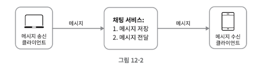

메시지 송신 클라이언트 - 채팅서비스(메시지 저장/전달) - 메시지 수신 클라이언트

### 프로토콜
- 송신 클라이언트가 채팅 서비스에 메시지를 보낼 때 HTTP 프로토콜을 사용한다.
- 초기 페이스 북 메세지 앱의 송신 클라이언트는 서버에 HTTP 프로토콜을 이용해 수신 클라이언트에게 보낼 메세지를 정한다. 이 때 keep-alive 헤더를 사용하면 TCP 핸드쉐이크 횟수를 줄일 수 있다.
- HTTP는 클라이언트가 연결을 만드는 프로토콜이며, 서버에서 수신 클라이언트에 임의 시점에 메세지를 보낼 때는 사용하기 어렵기 때문에, 다음의 기술이 사용되고 있다.
  - 서버가 연결을 만드는 것처럼 동작할 수 있도록 제안 된 기법들 
    - 폴링 (별로..)
      - 폴링은 수신 클라이언트가 서버에게 주기적으로 새 메세지가 있는지 물어보는 방법이다. 실제 주고 받는 글이 없음에도 불구하고 클라이언트에서 폴링이 없기 때문에 서버 자원이 불필요하게 낭비될 수 있다
    - 롱 폴링 (별로..)
      - 롱 폴링의 경우 클라이언트는 새 메시지가 반환되거나 타임아웃 될 때까지 연결을 유지한다. 클라이언트가 새 메시지를 받으면 기존 연결을 종료하고 서버에 새로운 요청을 보내어 모든 절차를 다시 시작한다
      - 단점
        - 서버 로드밸런스가 로드 밸런스 알고리즘을 사용한다면 송신 클라이언트와 수신 클라이언트가 같은 채팅 서버에 접속하지 않을 수 있다. 메시지를 받은 서버는 해당 메시지를 받을 수신 클라이언트의 연결을 가지고 있지 않을 수 있다. 로드 밸런싱에 sticky route 방식을 이용해야 한다
        - 서버 입장에서는 클라이언트가 연결을 해제했는지 아닌지 알 수 없다
        - 폴링에 비해서는 불필요한 리퀘스트 횟수가 줄지만 여전히 메시지를 받지 않는 클라이언트도 타임아웃이 일어날 때마다 주기적으로 서버에 다시 접속해야 한다
    - 웹소켓 
     
      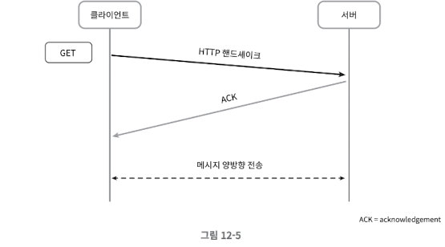
      - 웹 소켓은 서버가 클라이언트에게 비동기 메시지를 보낼 때 사용되는 기술이다
      - 웹소켓 연결은 클라이언트가 시작한다. 첫 연결은 HTTP 핸드쉐이크를 이용하고, 이후에는 서버가 클라이언트에게 비동기적으로 메시지를 전송할 수 있다. 웹소켓은 방화벽이 있는 환경에서도 잘 동작한다.
      - HTTP 프로토콜과 가장 다른 점은 양방향 통신이 가능하다는 것인데, 이 부분 떄문에 웹 소켓 대신 HTTP를 고집할 이유가 없다.

      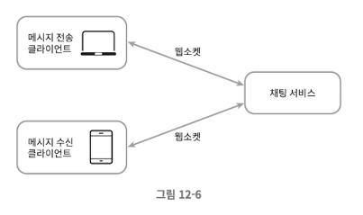

### 개략적 설계안 
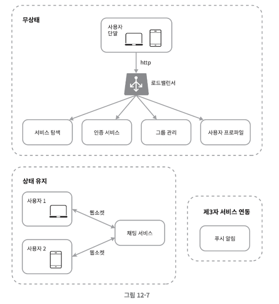
1. 무상태 서비스
   - 로그인, 회원가입, 사용자 프로파일 표시 등을 처리하는 보편적인 기능
   - 서비스와 사용자 단말간 긴밀한 연결을 유지하는 것이 아닌 그때 그때 요청을 처리하게 된다 
   - 로드밸런스 뒤에서 동작하기 때문에 특정 서비스로 라우팅 될 수 있게 설계가 필요(서비스 디스커버리 서비스 등)

2. 상태 유지 서비스 
   - 채팅 서비스
   - 클라이언트와 웹 소켓으로 채팅 서버간 긴밀이 연결된다 
   - 특정 서버로 부하가 몰리지 않게 적절하게 분배가 되어야 한다

3. 제 3자 연동 서비스 
   - 푸시알람은 모바일 서비스 주체자(OS) 와 연동이 필요하다 

4. 규모 확장성 
   - 서버 한대로 모든 걸 처리하는 것이 아니기 때문에 확장성이 필요
   - 서버 한대로 모든 연결을 처리하는 것이 아니라 서버간의 처리량이 얼마나 되는지 계산이 필요

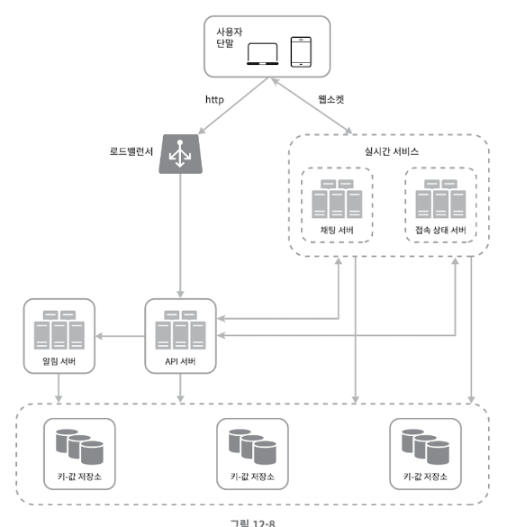

- 채팅 서버는 클라이언트 사이에 메시지를 중계하는 역할을 담당한다.
- 접속 상태 서버는 사용자의 접속 여부를 관리한다.
- API 서버는 로그인, 회원가입, 프로필 변경등 그 외 나머지 전부를 처리한다.
- 알림 서버는 푸시 알림을 보낸다.
- 키-값 저장소에 채팅 이력을 보관한다.

## 저장소

### 중요 한 것은 어떤 데이터베이스를 쓰는지이다
### SQL, NoSQL중 하나를 선택하기 위해 고려해야 하는 점은 데이터의 유형과 읽기/쓰기 연산의 패턴이다.

- 채팅 시스템이 다루는 데이터는 두 가지로 나뉘어진다.
  1. 사용자 프로필, 설정, 친구 목록처럼 일반적인 데이터
      1.  안정성을 보장하는 관계형 데이터 베이스에 보관한다. 
      2.  다중화(replication), 샤딩(sharding)은 데이터의 가용성과 규모 확장성을 보증하기 위해 보편적으로 사용되는 기술이다.
  2. 채팅 시스템에 고유한 데이터
      1. 채팅 이력 데이터를 의미한다.
   
- 읽기/쓰기 연산 패턴
  - 페이스북 메신저나 왓츠앱은 매일 600억개의 메시지를 처리한다.
  - 채팅 앱에서 빈번하게 쓰이는 데이터는 최근 메시지이다. 대부분 오래된 메시지는 들여다 보지 않는다.
  - 사용자는 대체로 최근 메시지를 보나 검색 기능, 특정 사용자가 언급된 메시지를 보거나, 특정 메시지로 점프하여 무작위 데이터를 접근하는 경우도 있다.
  - 1:1 채팅 앱의 경우 읽기:쓰기 비율은 대략 1:1정도다.
  - 이번 설계에서는 아래와 같은 이융로 SQL이 아닌 NoSQL을 선택한다.

- 이번 시스템에 NOSQL을 선택하는 이유
  - 키/값 저장소는 수평적 규모 확장이 쉽다.
  - 키/값 저장소는 데이터 접근 지연시간(latency)가 낮다.
  - 관계형 데이터베이스는 롱 테일(long tail)에 해당하는 부분을 잘 처리하지 못하는 경향이 있다. 인덱스가 커지면 데이터에 대한 무작위적 접근(random access)를 처리하는 비용이 늘어난다.
  - 페이스북 메신저는 HBase를 사용하고 디스코드는 카산드라 NoSQL을 사용하고 있다.

### 데이터 모델
  1. 1:1 채팅을 위한 메시지 테이블
     1. 이 테이블의 기본 키(primary key)는 message_id로, 메시지 순서를 쉽게 정할 수 있도록 하는 역할도 담당한다. 두 메시지가 동시에 만들어질 수 있기 때문에 create_at을 사용하여 메시지 순서를 정할 수는 없다.
    
        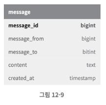 
  3. 그룹 채팅을 위한 메시지 테이블 
     1. channel_id, message_id의 복합 키를 기본 키로 사용한다. channel_id는 파티션 키(partition key)로도 사용할 것인데, 그룹 채팅에 적용될 모든 질의는 특정 채널을 대상으로 할 것이기 떄문이다.
  4. 메시지 ID
     1. 고유해야 하며 정렬 가능해야 하며 시간 순서와 일치해야 한다. 새로운 ID는 이전 ID보다 큰 값이어야 한다.
     2. NoSQL은 auto_increment를 제공하지 않기 때문에 스노플레이크 같은 전역적 64-bit 순서 번호(sequency number) 생성기를 이용한다.
     3. 다른 방법은 ID의 유일성은 같은 그룹 안에서만 보증하면 충분하기 떄문에 지역적 순서 번호 생성기 (local sequence number generator)를 사용한다.

## 상세 설계 

1. 서비스 탐색 
   1. 클라이언트의 위치(geographical location)
   2. 서버의 용량(capacity) 등이 있다.
   3. 널리 쓰이는 오픈 소스 솔루션으로는 아파치 주키퍼가 있다. 사용 가능한 채팅 서버를 여기에 등록해 두고, 클라이언트가 접속을 시도하면 사전에 정한 기준에 따라 최적의 채팅 서버를 골라준다.

    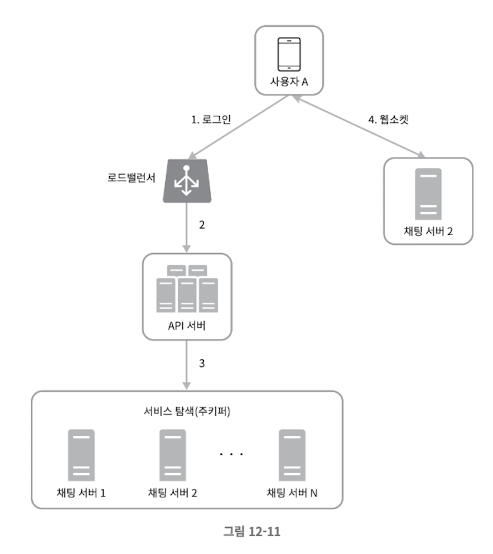 
   - 사용자 A가 시스템에 로그인을 시도한다.
   - 로드 밸런서가 로그인 요청을 API 서버들 가운데 하나로 보낸다.
   - API 서버가 사용자 인증을 처리하고 나면 서비스 탐색 기능이 동작하여 해당 사용자를 서비스할 최적의 채팅 서버를 찾는다. 예제의 경우 채팅 서버 2가 선택되어 사용자 A에게 반환된다.
   - 사용자 A는 채팅 서버2와 웹 소켓 연결을 맺는다.

2. 메시지 흐름 
- 1:1 채팅 메시지 처리 흐름
  
  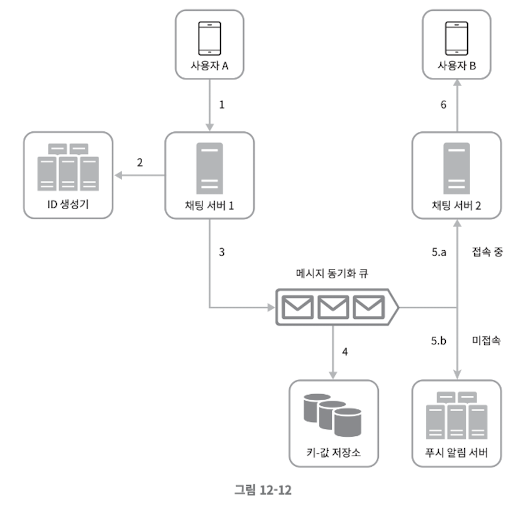
  1. 사용자 A가 채팅 서버 1로 메시지 전송
  2. 채팅 서버 1은 ID 생성기를 사용해 해당 메시지의 ID 결정
  3. 채팅 서버 1은 해당 메시지를 메시지 동기화 큐로 전송
  4. 메시지가 키-값 저장소에 보관됨
  5. 사용자 B가 접속 중인 경우, 메시지는 사용자 B가 접속 중인 채팅 서버인 채팅 서버2로 전송됨
  6. 사용자 B가 접속 중이 아니라면 푸시 알림 메시지를 푸시 알림 서버로 보냄
  7. 채팅 서버 2는 메시지를 사용자 B에게 전송. 사용자 B와 채팅 서버 2 사이에는 웹 소켓 연결이 되어있어 소켓을 사용함.

- 여러 단말 사이의 메시지 동기화

    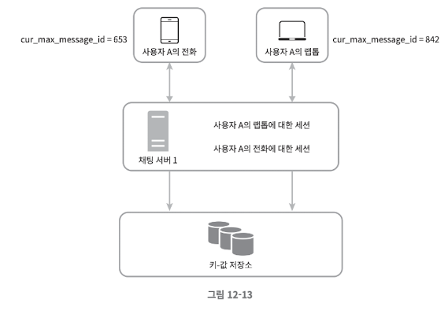

   - 사용자 A는 전화기와 랩톱 두 대의 단말을 사용하고 있다. 
   - 사용자 A가 전화기에서 채팅 앱에 로그인 한 결과로 채팅 서버 1과 해당 단말 사이에 웹 소켓이 만들어진다.
   - 랩톱에서 로그인한 결과 또한 별도 웹 소켓이 채팅 서버 1에 연결되어 있다.
   - 각 단말은 cur_max_message_id 변수를 유지하는데, 해당 단말에서 관측된 가장 최신 메시지의 ID를 추적하는 용도이다. 
   - 아래 두 조건을 만족하는 메시지는 새 메시지로 간주한다.
     - 수신자 ID가 현재 로그인한 사용자 ID와 같다.
     - 키-값 저장소에 보관된 메시지로서, 그 ID가 cur_max_message_id보다 크다.
   - cur_max_message_id는 단말마다 별도로 유지 관리하면 되는 값이라 키-값 저장소에서 새 메시지를 가져오는 동기화 작업도 쉽게 구현할 수 있다.

- 소규모 그룹 채팅에서의 메시지 흐름
  
  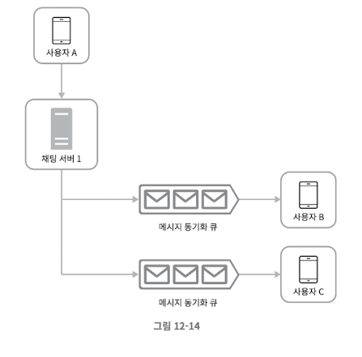

  - 그림 12-14를 보면, 사용자 A가 그룹 채팅 방에서 메시지를 보냈을 때 메시지가 사용자 B,C앞에 존재하는 각각의 메시지 동기화 큐에 들어가는데, 이 큐는 각 사용자를 위한 메시지 수신함 같은 것이다. 이 설계는 다음의 이유로 소규모 채팅방에 적합하다.
  - 새로운 메시지가 왔는지 확인하려면 자기 큐만 보면 되니까 메시지 동기화 플로우가 단순하다.
  - 그룹이 크지 않으면 메시지를 수신자별로 복사해서 큐에 넣는 작업의 비용이 문제가 되지 않는다.
  - 위챗이 위와 같은 접근법을 쓰고 있으며 그룹의 크기는 500명으로 제한하고 있다.
  - 위와 같은 설계를 수신자 관점에서 살펴보자. 여러 사용자가 보내는 메시지를 받아야 한다.

    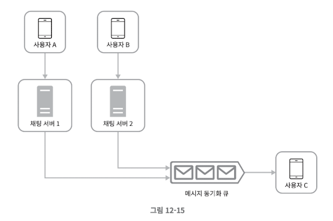

### 접속 상태 표시
- 채팅 어플리케이션을 사용하다보면 사용자 프로필 이미지나 대화명 옆에 녹색 점이 붙어 있는 것을 보게 된다. 
- 개략적 설계안에서는 접속 상태 서버를 통해 사용자의 상태를 관리한다고 했다.
- 사용자의 상태가 바뀌는 시나리오는 아래와 같다.

1. 사용자 로그인
   
   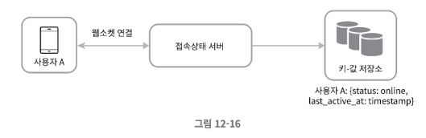

    - 로그인 절차는 서비스 탐색절에서 설명했었다. 
    - 클라이언트와 실시간 서비스 사이에 웹 소켓 연결이 맺어지고 나면 접속상태 서버는 A의 상태와 last_active_at 타임스탬프 값을 키-값 저장소에 보관한다. 이 절차가 끝나고 나면 해당 사용자는 접속 중인 것으로 표시된다.

2. 로그 아웃 

    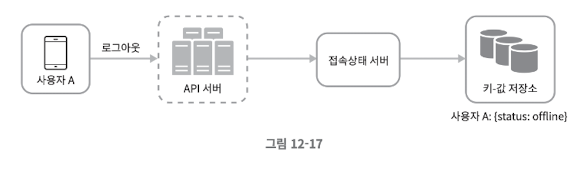

   - 사용자 로그아웃 시 키-값 저장소에 보관된 사용자 상태가 online에서 offline으로 변경된다.
   - 이 절차가 끝나고 나면 UI 상에서 사용자의 상태는 접속 중이 아닌 것으로 표시된다.

3. 접속 장애 
 - 짧은 시간동안 인터넷 연결이 끊어졌다 복구되는 현상에 대응할 수 있는 설계를 준비해야 한다. 
 - 사용자의 인터넷 연결이 끊어지면 웹소켓 같은 지속성 연결도 끊어진다. 
 - 이런 장애에 대응하는 간단한 방법은 사용자를 오프라인 상태로 표시하고 연결이 복구되면 온라인 상태로 변경하는 것이다. 
 - 하지만 짧은 터널을 반복해서 통과하는 동안 사용자의 접속 상태를 변경한다면 UX 측면에서 바람직하지 않다.
 - 본 설계에서는 heartbeat 검사를 통해 이 문제를 해결해 본다.
 - 온라인 상태의 클라이언트로 하여금 주기적으로 heartbeat event를 접속상태 서버로 보내고, 마지막 이벤트를 받은 지 x초 이내에 또 다른 heartbeat event 메시지를 받으면 해당 사용자의 접속 상태를 계속 온라인으로 유지한다. 그렇지 않은 경우에만 오프라인으로 바꾼다.

    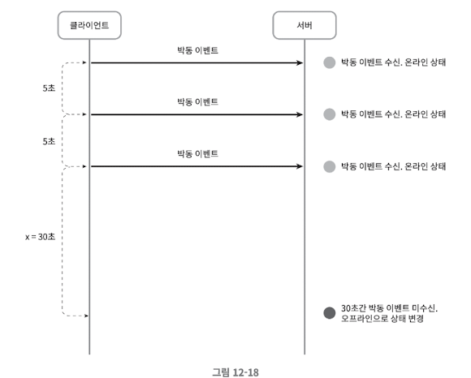

    - 그림 12-18의 클라이언트는 heartbeat event를 5초에 한번씩 서버로 보낸다. 이벤트를 3번 보낸 후, 클라이언트가 30초 동안 heatbeat event를 보내지 않았기 때문에 서버는 사용자를 오프라인 상태로 변경한다.

4. 상태 정보의 전송

    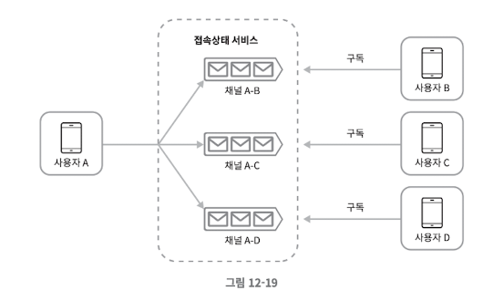

    - 상태 정보 서버는 publish-subscribe model을 사용하며 친구 관계마다 채널을 하나씩 둔다. 가령 사용자 A의 접속 상태가 변경되었다고 하면 A-B,A-C,A-D 세 개의 채널에 쓴다.
      - 채널 A-B : B가 구독
      - 채널 A-C : C가 구독
      - 채널 A-D : D가 구독
    - 클라이언트와 서버 사이의 통신에는 실시간 웹소켓을 사용한다.
    - 이 방안은 그룹의 크기가 작을 때 효과적이다. 위쳇이 이와 유사한 접근법을 사용한다.
    - 그룹의 크기가 커지면 이런 식의 접속 상태 변화 알림은 비용과 시간이 많이 든다. 가령 100,000 명의 사용자가 사용하는 채팅 그룹에서는 상태 변화 1건당 100,000개의 이벤트 메시지가 발생한다. 
    - 이를 해결하기 위해서는 입장하는 순간에만 상태 정보를 읽어가게 하거나, 친구 리스트에 있는 접속 상태를 갱신하고 싶으면 수동으로 하도록 유도한다.

## 마무리 
- 1:1 채팅과 그룹 채팅을 전부 지원하는 채팅 시스템의 아키텍처 문제에 접근
- 클라이언트와 서버 사이의 실시간 통신을 가능하도록 웹소켓 사용
- 다양한 컴포넌트들을 설계
  - 실시간 메시징을 지원하는 채팅서버
  - 접속상태 서버 
  - 푸시 알람 서버 
  - 채팅 이력보관용 키-값 저장소
  - 나머지 기능을 담당하는 API 서버 

### 뭔가를 더 할 수 있다면? 
  - 사진이나 미디어 기능 확장 
  - 종단간 암호화 
    - 왓츠앱은 메시지 전송에 있어 종단 간 암호화를 지원한다. 메시지 발신인과 수신자 이외에는 아무도 메시지를 볼 수 없다는 뜻이다.
  - 캐시 
  - 로딩 속도 개선 
    - 슬랙은 사용자의 데이터, 채널등을 지역적으로 분산하는 네트워크를 구축하여 앱 로딩 속도를 개선하였다.
  - 오류 처리 
    - 채팅 서버 오류: 채팅 서버 하나에 수십만 사용자가 접속해 있는 상황을 생각해보자. 그런 서버 하나가 죽으면 서비스 탐색 기능(주키퍼)가 동작하여 클라이언트에게 새로운 서버를 배정하고 다시 접속할 수 있도록 해야 한다.
    - 메시지 재전송: 재시도(retry)나 큐(queue)는 메시지의 안정적 전송을 보장하기 위해 흔히 사용된다.