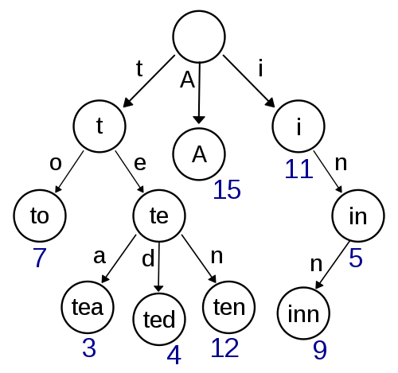
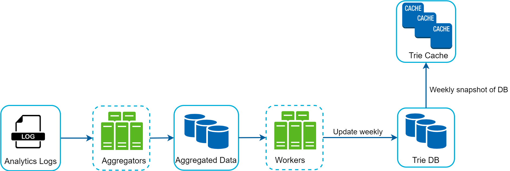

# 13장. 검색어 자동완성 시스템

검색어 자동완성

- autocomplete, typeahead, search-as-you-type, incremental search

---

## 1단계, 문제 이해 및 설계 범위 확정

Q) 입력하는 단어가 자동완성 될 검색어의 첫 부분? 중간 부분?

- 첫 부분으로 한정

Q) 몇 개의 자동완성 검색어가 표시되는가? 그리고 그 기준은 무엇인가?

- 5개
- 질의 빈도에 따른 검색어 인기 순위를 기준으로 함

Q) 다국어 지원은? 영어 대문자/소문자 지원?

- 다국어 지원은 생각만 해볼 것
- 질의는 소문자만 이루어진다고 가정

Q) 사용자 수?

- DAU 천만 (10million)

 

### 요구사항

- 빠른 응답속도: 약 100ms 이내여야 함. 아니면 이용이 불편해질 수 있다는 조사가 있음.
- 연관성: 자동완성 된 검색어들은 당연히 연관된 것이여야 함
- 정렬: 인기도 같은 순위모델에 의해 정렬되어야 함
- 규모 확장성 및 고가용성

 

### 개략적 규모 추정

- DAU 천만명 가정
- 한 사용자가 평균적으로 매일 10건의 검색을 수행한다고 가정
- 질의 때마다 20 바이트의 데이터를 입력한다고 가정

글자를 입력할 때마다 백엔드에 요청

- 즉, 1회 검색 당 20건의 request
- 초당 24,000건의 질의(QPS) (10,000,000 X 10 X 20 / 24 / 3600)
- 최대 QPS = 24,000 X 2 = 48,000

---

## 2단계, 개략적 설계안 제시 및 동의 구하기

시스템을 두 부분으로 나눌 수 있음

- 데이터 수집 서비스: 입력한 질의 수집하는 서비스
- 질의 서비스: 질의에 5개의 인기 검색어를 정렬해 반환하는 서비스

 

### 데이터 수집 서비스

`질의 단어`와 해당 질의 단어의 `빈도 수`를 저장

- 빈도 테이블 구성

 

### 질의 서비스

앞서 구성한 빈도 테이블 사용

- `Order by`, `Limit` SQL 질의를 통해 빈도 수 높은 질의 단어 5개를 가져올 수 있다.

요청 당 쿼리 발생

- 요청도 많은데, 데이터도 많아지면? DB가 병목될 것.

---

## 3단계, 상세 설계

### 트라이(Trie) 자료구조

[https://en.wikipedia.org/wiki/Trie](https://en.wikipedia.org/wiki/Trie)

트리형태의 자료구조로 문자열을 꺼내는 연산에 초점을 맞추어 설계된 자료구조

- 루트노드는 빈 문자열 나타냄
- 각 노드는 하나의 글자 저장, 최대 26개(알파벳)의 자식 노드를 가질 수 있음
- 리프노드로 가며 하나의 단어, 또는 접두어 문자열을 표현

 

트라이 자료구조에선 노드에 문자를 저장하지만, 질의 빈도 수도 필요하니 노드에 빈도 정보도 저장할 필요가 있음.

 

어떻게 가장 많이 질의된 단어를 찾아낼까?

- 질의로 들어온 단어 또는 접두어를 표현하는 노드를 찾는다
- 해당 노드부터 시작하는 하위 트리를 탐색한다.
- 유효한 검색 문자열을 갖는 노드(유효노드)를 찾는다.
- 유효노드를 정렬해 가장 인기 있는 검색어를 찾는다.

 

최악의 경우, k개 결과 얻으려고 트라이 다 검색해야 할 수도 있다.

성능을 올릴 수 없을까?

- 접두어의 최대 길이 제한
- 각 노드에 인기 검색어 캐시
    - 노드에 인기 검색어를 저장해야 하므로 공간이 더 필요하다는 단점
    - 빠른 응답속도 필요하면 사용
    

위 방법을 통해 시간복잡도를 O(1)로 수렴시킬 수 있다.

 

### 데이터 수집 서비스

매일 수천만 건의 질의

- 그 때마다 트라이 갱신? 실시간적인 인기검색어 변화 적음.  실시간 갱신 필요성 적음.

트라이를 만드는데 사용하는 데이터는 보통 데이터 분석 서비스/로깅 서비스로 부터 온다.

  

데이터 수집 서비스의 설계안

- Analytics logs: 입력된 질의에 관한 원본 데이터
- Aggregators: Log 취합 및 전처리, DB 저장
- Workers: 비동기적으로 트라이 자료구조 생성 및 저장
- Trie cache: 데이터 메모리에 유지시켜 읽기 연산 성능 높임 → 주기적으로 DB 스냅샷
- Trie DB
    - Document store
    - Key-value store
    
 

### 질의 서비스

- 서버 앞 단에서 로드밸런서로 부터 요청을 받음
- 서버로 요청이 들어오면 트라이 캐시에서 데이터 가져옴
- 캐시에 없으면 데이터베이스 조회해 캐시를 채움. 이후 캐시에서 가져옴.

 

더 생각해봐야하는 최적화 방안

- ajax 요청
    - 클라이언트의 페이지 새로고침 없이 요청 가능
- 브라우저 캐싱
    
    
- 데이터 샘플링
    - 모든 질의를 다 로깅? 자원부족할 수 있다.
    - N개 요청 중 1개만 로깅

 

### 트라이 연산

트라이 생성

- Workers가 담당
- Analytics logs로 부터 aggregate 된 데이터를 이용해 생성

트라이 갱신

- 주기적으로 새로운 트라이 생성 후 기존 트라이 대체
- 특정 트라이 노드만 대체하면 안되나?
    - 트라이 노드 갱신 시, 상위 노드에서도 질의 결과를 캐시(저장)하고 있기 때문에 상위 노드도 다 업데이트해야하는 번거로움이 있음.

 

### 검색어 삭제

제한하고 싶은 검색어의 경우 질의 과정에서 서버와 트라이 캐시 사이에 `필터` 를 둬서 제한할 수 있다.

 

### 저장소 규모 확장

대규모 서비스의 경우, 트라이가 커질 수 있다.

- 글자 기준으로 샤딩 해볼 수 있음. 하지만 특정 글자간 단어가 균등하지 않음.
- `shard map manager` 같은 검색어가 어느 저장소(샤드)에 저장되었는지를 저장하고 있는 컴포넌트를 추가해 관리할 수 있음.

---

## 4단계, 마무리

다국어 지원은 어떻게 할 수 있을까?

- 유니코드 사용 필요. 트라이에서 유니코드를 저장할 수 있도록.

 

국가별로 인기 검색어 순위가 달라야한다면?

- 국가별로 다른 트라이 구성
- CDN 이용 고려해볼 수 있음

 

실시간 성 서비스에도 위 구조가 적용이 가능할까?

- 실시간으로 트라이 업데이트를 진행하지 않으므로 불가.
- 실시간 서비스 시, 고려해봐야 할 점
    - 샤딩 통해 작업 대상 데이터 양 줄이기
    - 최근 검색어에 높은 가중치 부여하기
    - 데이터 스트림 형태 고려 → 스트림 프로세싱 시스템 필요(Apache Hadoop, Apache Spark, Apache Kafka 등)